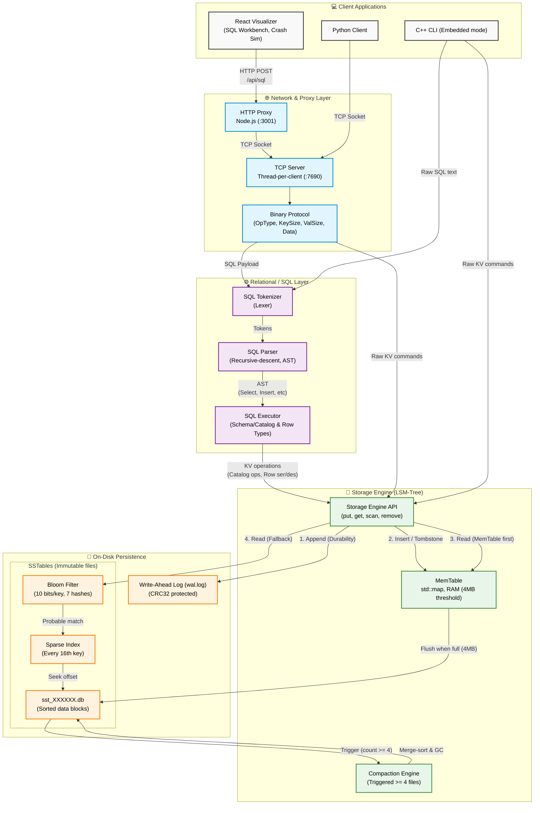

# MosaicDB

MosaicDB is a persistent key-value storage engine written in C++17 using the LSM-tree (Log-Structured Merge-tree) architecture. It is designed to be highly efficient for write-heavy workloads, ensuring durability and performance. Built on top of the storage engine is a full relational SQL layer, supported by a multi-threaded TCP server, a Python client, an HTTP proxy, and an interactive React-based visualizer.

---

## Architecture

The following diagram illustrates the flow of data from the client layer down to the on-disk storage engine:



---

## Features

- **LSM-Tree Storage Engine**: Sequential disk writes, optimized for high throughput.
- **Write-Ahead Log (WAL)**: Ensures strong durability; all operations are checksummed (CRC32) before being applied.
- **SSTables & MemTables**: Data is buffered in a `std::map` and flushed to immutable Sorted String Tables (SSTables) when full (4MB threshold).
- **Fast Lookups**: Employs **Bloom Filters** (10 bits/key, 7 hashes, ~0.82% false positive rate) and **Sparse Indexes** (every 16th key).
- **Relational SQL Layer**: Supports tables, types (INT, FLOAT, TEXT, BOOL), and queries (`CREATE`, `INSERT`, `SELECT`, `UPDATE`, `DELETE`, `WHERE`, `ORDER BY`, `LIMIT`).
- **Network Protocol**: Multi-threaded TCP server with a lightweight, little-endian custom binary protocol.
- **Client Ecosystem**: Python client for automation, an embedded C++ interactive CLI, and a Node.js proxy bridge.
- **Interactive Visualizer**: A rich React app to visualize LSM-tree compactions, simulate crashes/recovery, and provide a live SQL workbench.

---

## Getting Started

### Prerequisites
- C++17 Compiler (e.g., MSVC on Windows)
- Python 3.x (for the Python client)
- Node.js & npm (for the proxy and visualizer)

### Build (Windows)
Run the build script to compile the storage engine, server, and CLI tools:
```bat
build.bat
```
This produces `mosaicdb_cli.exe`, `mosaicdb_server.exe`, and unit test binaries in the `build/` folder.

### Run

**1. Start the Database Server:**
```bat
build\mosaicdb_server.exe --port 7690 --data mosaicdb_data
```

**2. Connect with a Client:**
Use the included Python client to connect:
```bat
python client\mosaic_client.py --host 127.0.0.1 --port 7690
```

**3. Launch the Visualizer (Optional):**
To use the web-based SQL workbench and visualization tools, start the HTTP proxy and React app:
```bat
:: Start the Proxy
node visualizer\proxy.mjs

:: In a new terminal, start the React App
cd visualizer
npm install
npm run dev
```

---

## Code Structure

- `include/mosaicdb/` / `src/storage/`: Core engine (WAL, MemTable, SSTable, Compaction)
- `include/mosaicdb/` / `src/sql/`: Relational layer (Tokenizer, Parser, Executor, Catalog)
- `src/network/`: Multi-threaded TCP Server
- `client/`: C++ CLI embedded interface and Python TCP Client
- `visualizer/`: Node.js Proxy bridge and the React + Vite web application

---

## Testing

The project includes an extensive test suite verifying everything from WAL integrity to network behavior. Test executables (e.g. `test_wal.exe`, `test_sql.exe`) are output to the `build/` directory. You can also run the integration tests using the Python test script (`test_network.py`).

## Images

|  |  |
|---|---|
|  |  |
|  |  |
